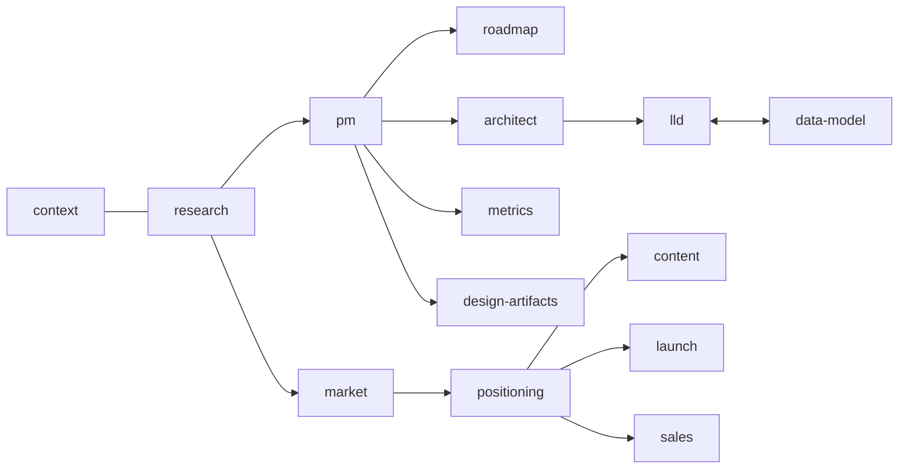

# founder-os

A library of Claude skills that cover the work a tech startup needs done, from first customer interview to launch. Each skill acts as a senior specialist (PM, architect, product marketer, and so on). All of them share one source of truth, so decisions made in one place carry into the next.

## Skills

| Group | Skills |
|---|---|
| Foundation | `founder-os-context` (shared vision, ICP, glossary, decisions, constraints) |
| Product & Engineering | `research` → `pm` → `roadmap`; `metrics`, `design-artifacts`; `architect` → `lld` ⇄ `data-model` |
| Go-to-market | `market` → `positioning` → `content`, `launch`, `sales` |

Full list with descriptions: [skills/INDEX.md](skills/INDEX.md). Every skill name is prefixed `founder-os-`.



## How the skills work together
`founder-os-context` holds one `context.md` per project. Every other skill reads it first and writes new terms and decisions back last (rules in [protocols.md](skills/founder-os-context/references/protocols.md)). IDs (`T-`, `D-`, `P-`, `C-`) never change, so a decision made in research is still referenceable in the HLD.

## See it working
[examples/northwind-pulse/](examples/northwind-pulse/) runs a fictional B2B SaaS through the whole chain. Read [examples/README.md](examples/README.md) first.

## Install
Copy or symlink the skill folders into one of:
- `~/.claude/skills/` (all projects)
- `<project>/.claude/skills/` (one project)

```bash
ln -s "$(pwd)"/skills/founder-os-* ~/.claude/skills/
```
On Windows, copy the folders, or use `mklink /D`.

## Usage
Ask in plain language: "I have an idea for a churn-alert tool, set up the context" or "write the PRD for this". Skills trigger from their descriptions. Skills that need other tools say so on their **Depends on** line (for example web search for `market`).

## Contributing
See [CONTRIBUTING.md](CONTRIBUTING.md). Run `python -I scripts/validate.py --write-index` before every commit.

## Not covered yet
Finance, legal, hiring, customer support, security/compliance, DevOps and code generation. These are planned for later releases (see [CHANGELOG.md](CHANGELOG.md)).
