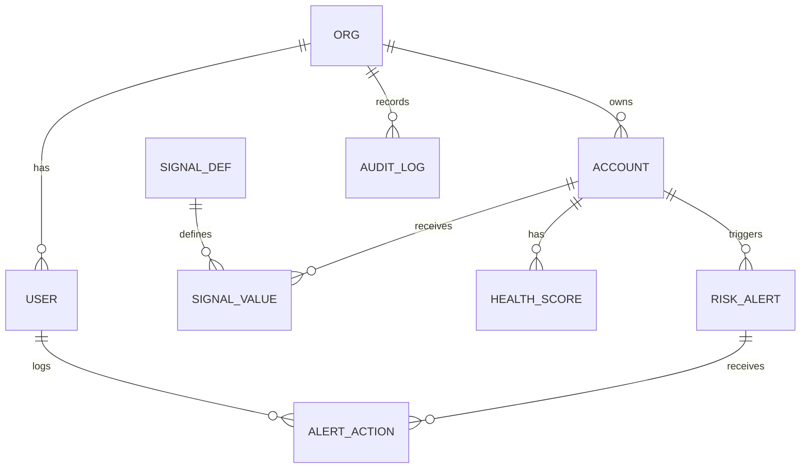

# Data model — ERD and schema notes
<!-- Produced by: founder-os-data-model. Read context v3 and lld-api.md. ILLUSTRATIVE SAMPLE. -->

## Key tables
| Table | Key columns | Notes |
|---|---|---|
| account | id, org_id, name, domain | Unique (org_id, domain). Matches CRM and billing records (PRD unhappy path) |
| signal_def | id, org_id, key, weight | Weight per org, defaults seeded |
| signal_value | account_id, signal_def_id, value, observed_at | Partition by month on observed_at |
| health_score | account_id, computed_on, score, prev_score | PK (account_id, computed_on) |
| risk_alert | id, account_id, status, opened_at | Partial unique index on (account_id) where status = 'open' |
| alert_action | id, alert_id, user_id, action_type, created_at | Source for `risk_alert_acted` event |
| audit_log | id, org_id, actor_id, action, at | Append-only (C-001) |

## Indexes and access patterns
- Ranked account list: index on health_score (computed_on desc, score asc), filtered to the latest day.
- Open alerts by org: partial index on risk_alert (status) where open.
- No end-customer PII columns beyond work email on `user` (C-003).

## Migration strategy
Expand-then-contract migrations; `signal_value` partitions created ahead by a monthly job. Backfill of history runs as a batch job before first scoring.
