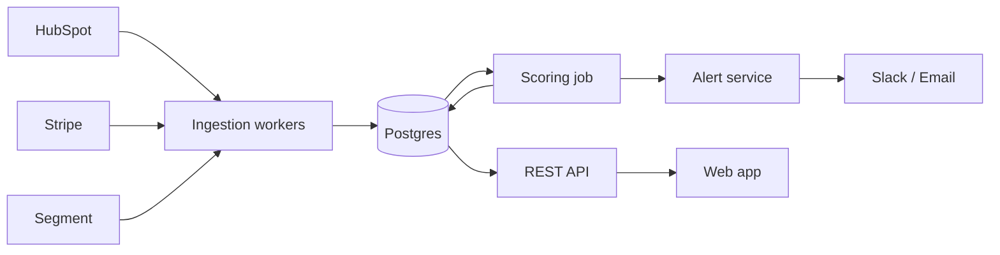

# HLD — Northwind Pulse
<!-- Produced by: architect. Read context v2; wrote back D-003. ILLUSTRATIVE SAMPLE. -->

## Architecturally significant requirements
- Daily scoring of ~50k Accounts (T-001) in under 30 minutes.
- Integrations must tolerate API rate limits and token expiry (PRD unhappy paths).
- SOC 2-ready audit logging (C-001); no end-customer PII (C-003).
- 4 engineers, 12 weeks (C-002): favour few moving parts.

## Components

## Stack (agreed, D-003)
| Layer | Choice | Why |
|---|---|---|
| Backend | TypeScript, NestJS modular monolith | One deployable fits C-002; team already knows TS |
| Database | Postgres | Relational Signals/Accounts model; JSONB for raw payloads |
| Queue | Postgres-backed job queue (graphile-worker) | Avoids running Redis/Kafka at this scale |
| Frontend | React + Vite | Standard, fast to build |
| Infra | Single cloud region, containers on a managed service | Lowest ops burden |

## Trade-offs
- No microservices or event bus: simpler now, extraction path kept via module boundaries.
- Daily batch scoring, not streaming: matches how CSMs work; revisit if users ask for real-time.

## Risks
Third-party API changes (mitigate with an adapter per integration); scoring cost growth past 500k Accounts.
