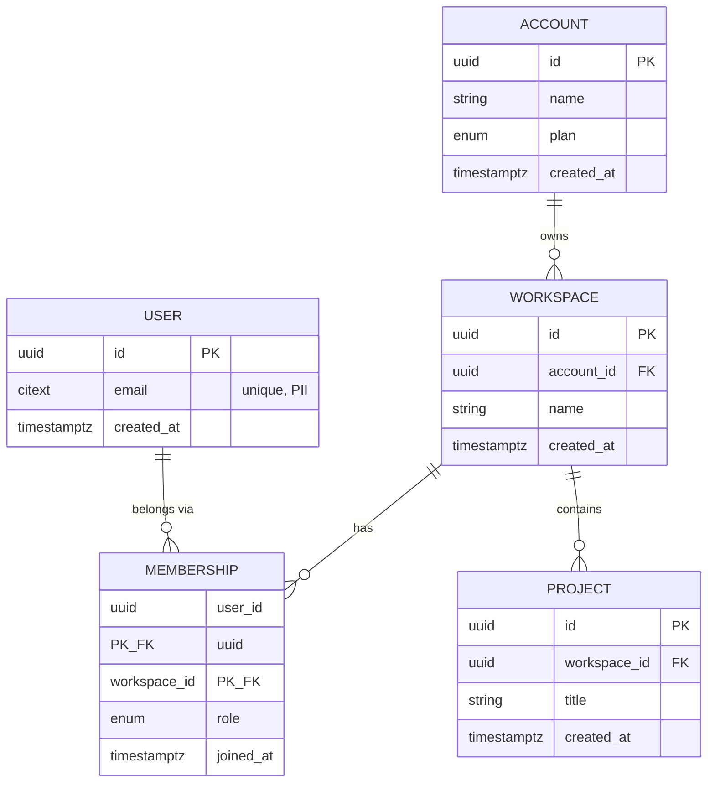

# ERD — <Product Name> data model

> Entities are 1:1 with the founder-os-context glossary. Render with Mermaid.

**Cardinality legend:** `||--o{` = one-to-many (mandatory parent, optional children) · `}o--o{` = many-to-many (resolve with a join entity).

**Notes**
- M:N between USER and WORKSPACE resolved via MEMBERSHIP (carries `role`).
- Flag PII attributes; note on-delete behavior on each FK.
